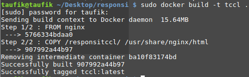
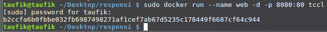
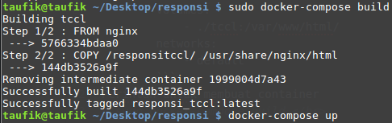
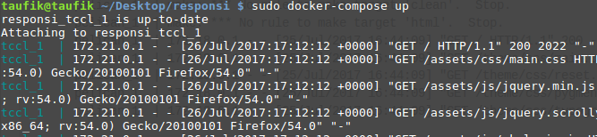
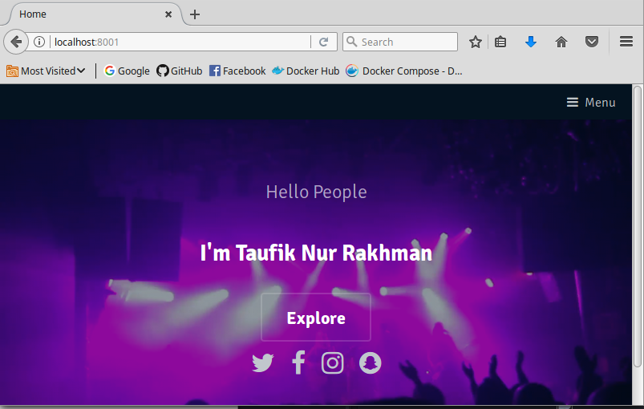

# RESPONSI TEKNOLOGI CLOUD COMPUTING LANJUT
> By Taufik Nur Rakhman <br>
> 145410215

## Membuat Aplikasi Web untuk uji coba diserver local.

## Dockerfile
* Dockerfile merupakan script yang yang berisi dari serangkaian perintah yang akan dieksekusi secara otomatis dan berurutan untuk membuat sebuah image. Berikut ini script pada dockerfile :

```
FROM nginx
COPY /responsitccl/ /usr/share/nginx/html

```
##### Penjelasan:

1. Images yang digunakan adalah *nginx*.
2. COPY: untuk memindahkan direktori *responsitccl* ke dalam docker.
</br>

Kemudian build dan memberikan nama dockerfile dengan perintah berikut:
> sudo docker build -t tccl </br>

 **tccl** merupakan nama dari docker images yang akan dibuat. Maka hasilnya seperti ini:

<p align="center"><br></p>


Kemudian jalankan Dockerfile dengan perintah sebagai berikut:
> sudo docker run --name web -d -p 8080:80 tccl

Perintah ini yaitu menjalankan images *tccl* pada localhost port 8080:80 dengan nama **web**
</br>
<p align="center"><br></p>


## Docker Compose
Docker Compose ini digunakan untuk membuat container dari docker images.
```
version: "2"
services:
    tccl:
        build: .
        ports:
            - "8001:80"
        volumes:
            - ./tccl:/var/www/html/
        networks:
            - default
```

Berikut adalah perintah untuk membangun dari container diatas.
> sudo docker-compose build </br>
<p align="center"><br></p>


Perintah untuk menjalankan container yang telah dibangun, dan maka hasilnya dapat dilihat dibawah ini:

> sudo docker-compose up
<p align="center"><br></p>

Setelah berhasil menjalankan docker compose, kemudian akses http://localhost:8001/ pada browser sebagai host Docker, maka akan muncul halaman web seperti dibawah ini:
<p align="center"><br></p>
